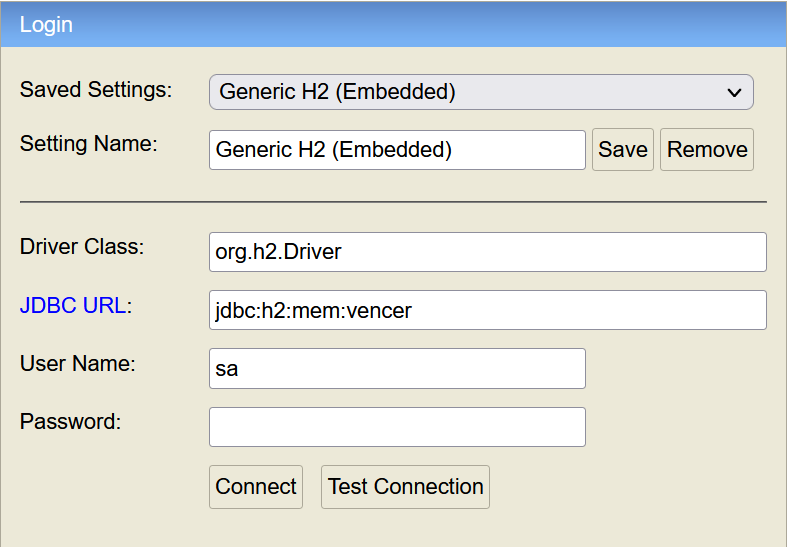
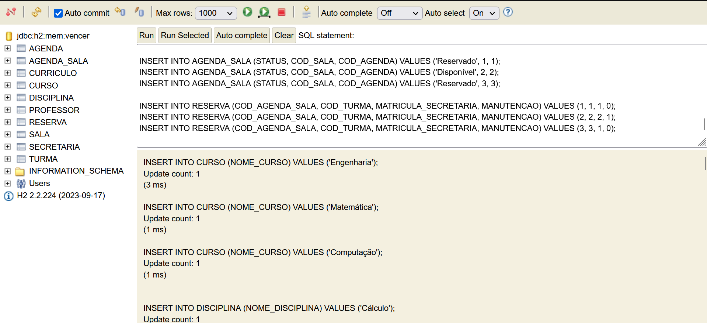

### Sistema de Reserva de Salas

)

Este projeto é um sistema de reserva de salas para faculdades e escolas de ensino básico. A aplicação é composta por uma API desenvolvida em Java e um front-end em HTML, CSS e JavaScript.

#### Alunos

- ANDRÉIA DOMINGOS SERAFIM
- GABRIEL CRUZ DOS PASSOS
- MILENA OLIVEIRA ARANTES
- NÚBIA CAROLINE RAMOS CISCATI

#### Curso

- **Curso:** Análise e Desenvolvimento de Sistemas
- **Semestre:** 3 Semestre
- **Matéria:** Programação Orientada a Objetos
- **Faculdade:** FATEC Indaiatuba

#### Funcionalidades

- Login de usuários
- Reserva de salas
- Visualização de reservas
- Cancelamento de reservas

#### Tecnologias Utilizadas

- **Back-end:** Java (Spring Boot)
- **Front-end:** HTML, CSS, JavaScript
- **Banco de Dados:** H2
- **Hospedagem da API:** Render
- **Containerização:** Docker

#### Tutorial para Inserir Dados no H2

1. Acesse o link: [Console H2](https://vamosvencer.onrender.com/h2).  
**Observação:** O sistema reinicia após 15 minutos de inatividade, por isso pode demorar alguns segundos para reiniciar e o site abrir.
2. Utilize os dados mostrados na imagem abaixo para fazer o login:
   
   

3. Após o login no Banco de Dados online, para inserir os dados, copie o conteúdo do arquivo [`inserir_dados.txt`](inserir_dados.txt) e cole no console do H2.
4. Veja a imagem abaixo para referência:

   

5. Clique em "Run" para executar os comandos e inserir os dados no banco de dados.

#### Acesso

A aplicação pode ser acessada online através do link: [Sistema de Reserva de Salas](https://milena-arantes.github.io/BookMe/index.html)

- **Usuário:** admin - **Senha:** admin

- **Usuário:** carlosf - **Senha:** senha123

- **Usuário:** lucianab - **Senha:** senha456

- **Usuário:** joaos - **Senha:** senha789

- **Usuário:** 222222 - **Senha:** 1122

#### Licença

Este projeto está licenciado sob a licença MIT. Consulte o arquivo `LICENSE` para mais informações.
